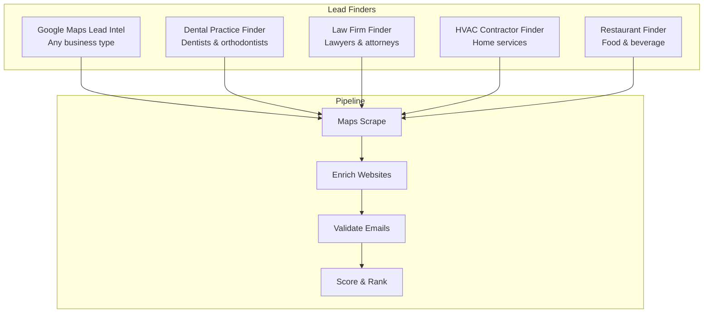
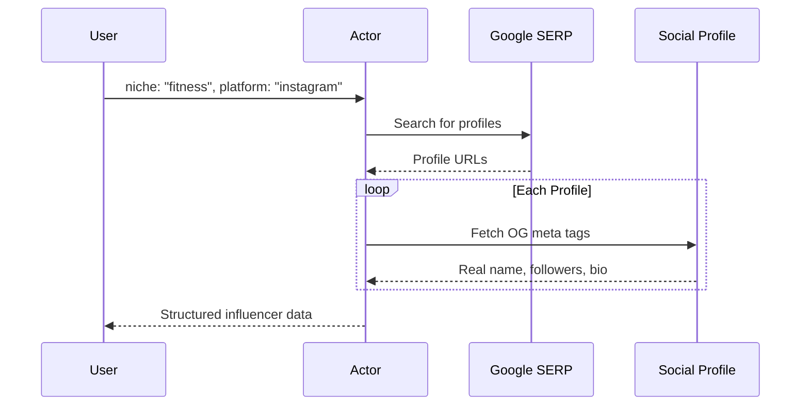

# Apify Actor Portfolio

67 production actors for web scraping, lead generation, AI analysis, and data enrichment. 900+ users across Apify Store and RapidAPI.

[](https://apify.com/george.the.developer)
[]()
[]()

## How It Works


## Actor Categories

### Lead Generation ($25 to $39 per search)

Find local businesses with verified contacts, validated emails, and lead scores.



| Actor | Price | What You Get |
|-------|-------|-------------|
| [Google Maps Lead Intel](https://apify.com/george.the.developer/google-maps-lead-intel) | $39/search | 20 businesses with phone, email, website, social, lead score |
| [Dental Practice Finder](https://apify.com/george.the.developer/dental-practice-lead-finder) | $39/search | Dental practices with patient acquisition scoring |
| [Law Firm Finder](https://apify.com/george.the.developer/law-firm-lead-finder) | $39/search | Law firms with legal marketing scoring |
| [HVAC Contractor Finder](https://apify.com/george.the.developer/hvac-contractor-lead-finder) | $29/search | HVAC contractors with home services scoring |
| [Restaurant Finder](https://apify.com/george.the.developer/restaurant-lead-finder) | $25/search | Restaurants with F&B marketing scoring |

### Influencer Marketing



| Actor | Price | What You Get |
|-------|-------|-------------|
| [Influencer Marketing Intelligence](https://apify.com/george.the.developer/influencer-marketing-intel) | $0.01/profile | Real names, follower counts, bios, emails across IG/TikTok/YT |

### AI Analysis APIs

Instant response APIs for text analysis and content detection.

| Actor | Price | What It Does |
|-------|-------|-------------|
| [AI Content Detector](https://apify.com/george.the.developer/ai-content-detector) | $0.003/text | Detect AI generated text with hybrid statistical + LLM analysis |
| [AI Text Humanizer](https://apify.com/george.the.developer/ai-text-humanizer-api) | $0.003/text | Rewrite AI text to pass detection |
| [Sentiment Analysis](https://apify.com/george.the.developer/sentiment-analysis-api) | $0.003/text | Multilingual sentiment with emotion detection |

### Data Enrichment APIs

| Actor | Price | What It Does |
|-------|-------|-------------|
| [Email Validator](https://apify.com/george.the.developer/email-validator-api) | $0.002/email | SMTP verification, disposable detection, scoring |
| [Company Enrichment](https://apify.com/george.the.developer/company-enrichment-api) | $0.01/company | Tech stack, social profiles, contacts, DNS |
| [Website Intelligence](https://apify.com/george.the.developer/website-intelligence-api) | $0.005/site | SEO score, tech detection, metadata |
| [Domain WHOIS](https://apify.com/george.the.developer/domain-whois-lookup) | $0.005/domain | WHOIS + DNS records |
| [URL Metadata](https://apify.com/george.the.developer/url-metadata-extractor) | $0.003/url | OG tags, meta, structured data |

### Web Scrapers

| Actor | Price | Target |
|-------|-------|--------|
| [LinkedIn Employee Scraper](https://apify.com/george.the.developer/linkedin-company-employees-scraper) | $0.005/profile | Employee data without login |
| [YouTube Transcript](https://apify.com/george.the.developer/youtube-transcript-scraper) | $0.004/video | Video transcripts for RAG/search |
| [Google Scholar](https://apify.com/george.the.developer/google-scholar-scraper) | $0.004/paper | Academic papers and citations |
| [Telegram Channel](https://apify.com/george.the.developer/telegram-channel-scraper) | $0.003/message | Channel messages and media |
| [Threads by Meta](https://apify.com/george.the.developer/threads-scraper) | $0.004/post | Threads posts and profiles |
| [Google News](https://apify.com/george.the.developer/google-news-brand-monitor) | $0.003/article | News monitoring by keyword |
| [Bluesky](https://apify.com/george.the.developer/bluesky-scraper) | $0.003/post | AT Protocol posts and profiles |

### Compliance & Intelligence

| Actor | Price | What It Does |
|-------|-------|-------------|
| [OFAC Sanctions Screener](https://apify.com/george.the.developer/ofac-sanctions-screener) | $0.01/entity | SDN list screening with fuzzy matching |
| [Entity OSINT Enricher](https://apify.com/george.the.developer/entity-osint-enricher) | $0.025/entity | Multi source entity intelligence |
| [US Tariff Lookup](https://apify.com/george.the.developer/us-tariff-hs-code-lookup) | $0.005/lookup | HS code tariff rates by country |

## Quick Start

```javascript
import { ApifyClient } from 'apify-client';

const client = new ApifyClient({ token: 'YOUR_TOKEN' });

// Find dentists in Miami with verified emails
const run = await client.actor('george.the.developer/dental-practice-lead-finder').call({
    searchQuery: 'dentists in Miami FL',
    maxResults: 20,
    enrichWebsites: true,
    validateEmails: true,
});

const { items } = await client.dataset(run.defaultDatasetId).listItems();
console.log(`Found ${items.length} dental practices`);
```

## Output Example

```json
{
    "rank": 1,
    "leadScore": 92,
    "practiceName": "Smile Design Dental",
    "category": "Dentist",
    "address": "123 Main St, Miami, FL 33101",
    "phone": "+1-305-555-0123",
    "website": "https://smiledesigndental.com",
    "rating": 4.8,
    "reviewCount": 234,
    "emails": [
        { "email": "info@smiledesigndental.com", "valid": true, "score": 100 }
    ],
    "socialProfiles": {
        "facebook": "https://facebook.com/smiledesigndental",
        "instagram": "https://instagram.com/smiledesigndental"
    }
}
```


## New in May 2026

Nine new actors shipped in May 2026. All Standby APIs with pay per event pricing. Pricing activates 2026-05-26 (sprint #1, 6 actors), 2026-05-27 (sprint #2, 2 actors), and 2026-05-29 (js-content-crawler-lite-rag).

| Actor | Store | What it does | Pricing |
|-------|-------|--------------|---------|
| Hospital Price Transparency MRF Normalizer | [apify](https://apify.com/george-the-developer/hospital-mrf-normalizer) | CMS MRF files normalized into payer + code + rate rows | $0.50 + $0.002/row + $0.02/bundle |
| MCP Server Registry and Security Scorer | [apify](https://apify.com/george-the-developer/mcp-server-registry-scorer) | Anthropic registry + npm + GitHub joined with deterministic risk score | $0.50 + $0.025/profile + $0.15/scan |
| FDA Warning Letter and Enforcement Monitor | [apify](https://apify.com/george-the-developer/fda-warning-letter-monitor) | FDA letters classified by topic with company risk briefs | $1 + $0.30/letter + $1.50/brief |
| Clinical Trial Investigator and Site Intelligence | [apify](https://apify.com/george-the-developer/clinical-trial-investigator-intel) | ClinicalTrials.gov + NPI + OpenPayments joined with site fit scoring | $1 + $0.10/investigator + $0.50/site |
| Federal Contract Opportunity Monitor | [apify](https://apify.com/george-the-developer/federal-contract-opportunity-monitor) | SAM.gov + USAspending normalized with topic tagging and partnership leads | $1 + $0.10/opportunity + $0.50/lead |
| LLM Provider Price and Latency Monitor | [apify](https://apify.com/george-the-developer/llm-provider-price-latency-monitor) | OpenRouter + provider pages normalized for 200+ models with cross provider benchmarks | $0.50 + $0.025/snapshot + $0.15/benchmark |
| Multi City Building Permit Aggregator | [apify](https://apify.com/george-the-developer/multi-city-building-permit-aggregator) | NYC + Chicago open data portals normalized into one permit schema | $1 + $0.05/permit + $0.30/contractor roundup |
| GLP-1 Pharmacy Price and Availability Tracker | [apify](https://apify.com/george-the-developer/glp1-pharmacy-availability-tracker) | Cost Plus Drugs + openFDA shortage data normalized into per-drug-per-pharmacy rows | $0.50 + $0.05/price-row + $0.25/availability-alert |
| JS Content Crawler Lite for RAG | [apify](https://apify.com/george.the.developer/js-content-crawler-lite-rag) | Static-first web content extraction with optional Browserless rendering. Returns clean Markdown plus 16 other fields per URL. Built for RAG ingestion. | $0.005/static page-extracted + $0.015/js-page-rendered |

Docs and examples for each are at github.com/the-ai-entrepreneur-ai-hub. The js-content-crawler-lite-rag docs live at [js-content-crawler-lite-rag-docs](https://github.com/the-ai-entrepreneur-ai-hub/js-content-crawler-lite-rag-docs).

The render mode uses the same Browserless-on-VPS infrastructure as other render-mode actors, proxied via nginx HTTPS termination at georgegotls.duckdns.org.

## Use Cases

**Lead gen agencies** run searches for any local business type in any city. One search replaces 3 to 4 hours of manual research.

**Marketing agencies** find micro influencers in any niche with real contact info. Works across Instagram, TikTok, and YouTube.

**Compliance teams** screen entities against OFAC sanctions lists. Cheaper than enterprise solutions.

**Sales teams** validate email lists before cold outreach. SMTP checks catch dead addresses that regex misses.

**AI researchers** detect AI generated content or analyze sentiment across 140+ languages.

## Also on RapidAPI

All API actors are also available on [RapidAPI](https://rapidapi.com/georgethedeveloper3046) with free tier access.

## Contact

Questions or custom requirements? Reach out on [Apify Store](https://apify.com/george.the.developer) or [@ai_in_it on X](https://x.com/ai_in_it).
