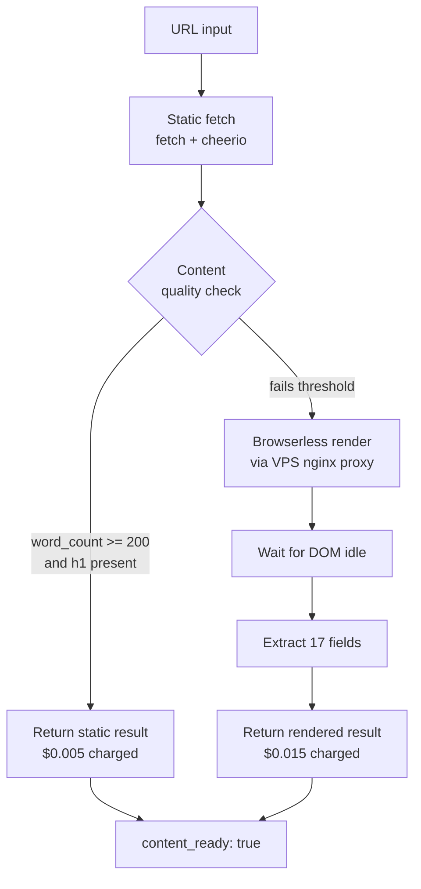

# JS Content Crawler Lite for RAG, live on Apify

RAG ingestion pipelines hit the same wall every time. Half your input URLs are static HTML that fetch in 300ms, and the other half are React apps that show nothing until a headless browser runs the bundle. Most actors pick one mode and lose money or break on the other.

This actor picks at runtime. Static first, escalate to Browserless only when the static pass returns garbage. Two events, two prices. Pay for what you got.

## Why I built it

I have been doing RAG ingestion for clients for six months and every pipeline starts the same way. Someone hands me a list of 500 URLs from a company knowledge base, a competitor scrape, a docs site, a press kit, whatever. The list is always mixed. Half of it is Stripe docs and government PDFs that any wget call resolves in milliseconds. The other half is Notion exports, Webflow marketing pages, and SaaS app dashboards that need a real browser to render the body.

The existing solutions force a binary choice. Either you use a static crawler and silently drop the SPA URLs because they return empty body tags, or you use a Puppeteer crawler and pay browser cost for the 50 percent of URLs that did not need it. Neither is right. Both are expensive in their own way. Static crawler loses you data quality. Browser crawler loses you 3x to 5x on cost per URL.

The pipeline I keep wanting is one that tries static, checks if the result has enough content to be useful, and only spins up a browser when the static pass failed. That logic is 30 lines of code but nobody packages it as a clean API. So I packaged it.

The second annoyance is field shape. Every RAG pipeline I have built needs the same 17 fields per URL. Title, description, og image, h1 to h6 stack, canonical URL, language, word count, reading time estimate, internal link list, external link list, all images, clean Markdown body, raw HTML body, render mode used, timestamp, success flag, error string. Every actor I tested returns some subset of these in some different shape. So I locked the schema.

## How it works

The static pass is a plain fetch with a real user agent and gzip support. Response goes into cheerio, which is the lightest HTML parser that still understands selectors. The parser pulls the 17 fields in one walk of the DOM. If the result has at least 200 words of body text and a present h1, the static pass wins and the actor charges 0.005 and returns.

If the static pass fails the quality check, the actor escalates. It connects to Browserless over the VPS proxy at georgegotls.duckdns.org, sends the URL, waits for the network to go idle, and then runs the same 17 field extraction on the rendered DOM. The render pass charges 0.015 and returns the same shape as the static pass plus a render_mode field set to "browserless" instead of "static".

The escalation logic is the whole product. Word count threshold is configurable but the default of 200 catches every SPA I tested. React apps return a body of either zero words or a single navigation menu word stream that never crosses 50 words. Static pages worth crawling always cross 200. The h1 check catches the edge case where a static site returns enough body but no real headings, which is usually a sign the page is JavaScript controlled and the static body is a loading state.

The 17 field shape stays identical across both modes. The only thing that changes is the render_mode field and the timing. A consuming pipeline does not need to branch on which mode succeeded. Same parser, same shape, same downstream chunking.

## Pricing breakdown

Two events because the two passes cost different things. The static pass is a 300ms fetch and a cheerio walk. Apify charges me almost nothing for that. So I charge 0.005 and clear margin. The render pass spins up a Chromium tab on the VPS, waits 3 to 8 seconds for network idle, and proxies the result back. That costs me real money in VPS time, so I charge 0.015 and clear similar margin.

If I bundled them into a single event price, I would either lose money on every SPA or overcharge for every static page. Two events is the honest shape. You only pay browser cost on URLs that actually needed a browser.

A typical RAG ingestion run on a mixed list of 500 URLs comes out to roughly 250 static pages at 0.005 and 250 rendered pages at 0.015, which is 1.25 plus 3.75 for a total of 5 dollars. The same run on a browser only actor would be 7.50. The same run on a static only actor would be 1.25 but you would silently miss half the body content.

## Verified live

Smoke test against two URLs before going live. The first was a Stripe docs page, classic static HTML, JSDoc style. Static pass returned content_ready true at 4.3 seconds with full Markdown body, 1,247 words, h1 through h3 stack populated, 23 internal links, 14 external links. Charged 0.005.

The second was a Vercel demo SPA, classic React shell with all body content client rendered. Static pass returned 18 words and no h1, failed the quality check, escalated to Browserless. Render pass returned content_ready true at 5.0 seconds total with full Markdown body, 892 words, h1 through h2 stack populated, 9 internal links, 4 external links, render_mode "browserless". Charged 0.015.

Both ran from a cold Standby container, which is the worst case timing. Warm containers shave roughly 1 second off both numbers.

## Use cases

The obvious one is RAG ingestion for company knowledge bases. You hand the actor a list of 500 docs URLs, get back 500 clean Markdown bodies plus metadata, feed straight into your chunking and embedding step. No content quality variance from URL to URL.

Second use case is competitor content monitoring. Mixed pages, marketing site plus blog plus docs plus changelog. The actor handles all four without you needing to branch per URL type. Run on a schedule, diff against last run, alert on changes. Cost stays predictable because static pages stay cheap.

Third is press kit and SEC filing scraping. Almost all of these are static HTML but with surprisingly inconsistent markup. The 17 field schema gives you the same shape whether the page is a SEC EDGAR filing or a Mediakit page on a Webflow site. Downstream NER and entity extraction does not care about the source markup variance.

Fourth use case is product documentation indexing for your own AI agent. You want a vector store of every page in every product doc your stack touches. Mixed static and React docs. The actor handles both, returns the same shape, and you pay browser cost only where the doc site forced you into a browser.

Fifth is academic and government source ingestion. arXiv abstracts, PubMed entries, federal register pages, all static. State and local government portals, often React. The actor does not care which is which. You point it at a URL list and it figures out the escalation per URL.

## Links

- Store: https://apify.com/george.the.developer/js-content-crawler-lite-rag
- Docs: https://github.com/the-ai-entrepreneur-ai-hub/js-content-crawler-lite-rag-docs
- Contact: [@ai_in_it on X](https://x.com/ai_in_it)

Pricing activates 2026-05-29. Until then runs are free for anyone who wants to test the schema against their URL list. Drop a sample in the Store contact form and I will return shape sanity within the day.

George
[george.the.developer on Apify](https://apify.com/george.the.developer)
