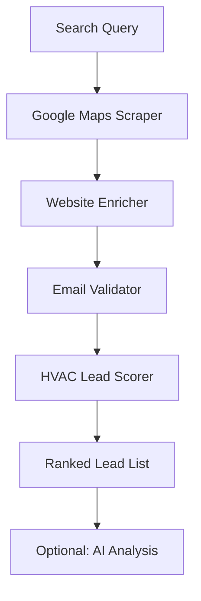

# HVAC Contractor Lead Finder - Home Services Marketing Leads

Find, enrich, and score HVAC contractor leads from Google Maps. Built for home services marketing agencies who need verified contact data and qualified lead lists for HVAC, plumbing, and mechanical contractor clients.

## What it does

1. **Scrapes Google Maps** for HVAC contractors matching your search query
2. **Enriches each company** with website data, emails, and social profiles
3. **Validates emails** to ensure deliverability
4. **Scores and ranks leads** using an HVAC-tuned scoring algorithm that prioritizes phone availability and service signals

## Why this exists

HVAC contractors spend $3K-$15K/month on marketing but most have terrible online presence. They rely on phone calls (not email) and care about reviews less than other verticals. Generic lead scrapers score them wrong. This tool uses HVAC-specific scoring so your outreach targets the right contractors.

## Input examples

```json
{
    "searchQuery": "HVAC contractors in Phoenix AZ",
    "maxResults": 50,
    "enrichWebsites": true,
    "validateEmails": true,
    "minRating": 3.0
}
```

More search queries that work well:
- `"air conditioning repair Dallas"`
- `"heating companies Chicago"`
- `"furnace installation Denver"`
- `"AC service Miami"`
- `"commercial HVAC contractors Atlanta"`

## Output fields

| Field | Description |
|-------|-------------|
| `rank` | Position in scored results (1 = best lead) |
| `leadScore` | 0-100 quality score tuned for HVAC vertical |
| `companyName` | Contractor company name |
| `vertical` | Always `"hvac"` |
| `category` | Google Maps category |
| `address` | Full street address |
| `phone` | Phone number (critical for HVAC) |
| `website` | Company website URL |
| `rating` | Google Maps rating |
| `reviewCount` | Number of Google reviews |
| `emails` | Array of found emails with validation status |
| `socialProfiles` | LinkedIn, Facebook, Twitter, etc. |
| `enrichment` | Raw website enrichment data |
| `aiAnalysis` | AI-powered sales intelligence (optional) |

## Scoring algorithm (HVAC-tuned)

| Signal | Points | Why |
|--------|--------|-----|
| Has phone | +20 | HVAC customers call for emergencies, phone is king |
| Has website | +15 | Online presence baseline |
| Has email | +20 | Outreach channel |
| Email validated | +10 | Deliverable = actionable |
| Rating >= 3.5 | +15 | Lower bar than other verticals, HVAC is less review-sensitive |
| Rating >= 4.5 | +5 bonus | Top-tier contractor |
| Reviews > 25 | +10 | Active business with customer base |
| Reviews > 75 | +5 bonus | Well-established contractor |
| Social profiles | +5 | Marketing-aware company |

## Pricing

**$29 per search** (pay-per-event). Each search scrapes, enriches, validates, and scores up to your `maxResults` limit.

## Who this is for

- Home services marketing agencies
- HVAC lead generation companies
- Home services CRM platforms (ServiceTitan, Housecall Pro)
- Equipment distributors prospecting for dealer relationships
- Financing companies targeting HVAC contractors

## Architecture


