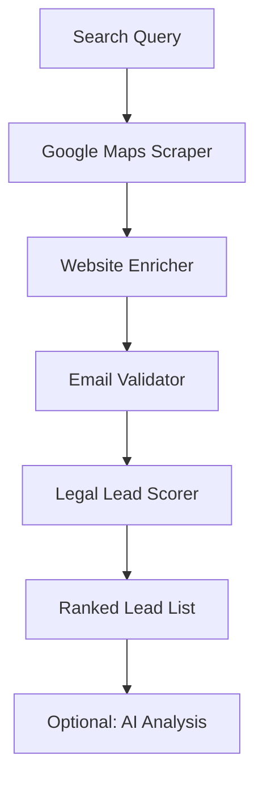

# Law Firm Lead Finder - Legal Marketing Intelligence

Find, enrich, and score law firm leads from Google Maps. Built for legal marketing agencies who need verified contact data and qualified lead lists for attorney clients.

## What it does

1. **Scrapes Google Maps** for law firms matching your search query
2. **Enriches each firm** with website data, emails, and social profiles
3. **Validates emails** to ensure deliverability
4. **Scores and ranks leads** using a legal-vertical scoring algorithm tuned for law firms

## Why this exists

Law firms are high-value clients ($5K-$50K+ retainers) but hard to reach. Generic lead scrapers miss the nuances: lawyers get fewer reviews, websites signal credibility more than most verticals, and practice area matters for targeting. This tool is built specifically for legal marketing.

## Input examples

```json
{
    "searchQuery": "personal injury lawyers in Houston TX",
    "maxResults": 50,
    "enrichWebsites": true,
    "validateEmails": true,
    "minRating": 3.5
}
```

More search queries that work well:
- `"family law attorneys Phoenix"`
- `"criminal defense lawyers New York"`
- `"immigration lawyers Los Angeles"`
- `"estate planning attorneys Chicago"`
- `"DUI lawyers Atlanta"`

## Output fields

| Field | Description |
|-------|-------------|
| `rank` | Position in scored results (1 = best lead) |
| `leadScore` | 0-100 quality score tuned for legal vertical |
| `firmName` | Law firm name |
| `vertical` | Always `"legal"` |
| `category` | Google Maps category |
| `address` | Full street address |
| `phone` | Phone number |
| `website` | Firm website URL |
| `rating` | Google Maps rating |
| `reviewCount` | Number of Google reviews |
| `emails` | Array of found emails with validation status |
| `socialProfiles` | LinkedIn, Facebook, Twitter, etc. |
| `enrichment` | Raw website enrichment data |
| `aiAnalysis` | AI-powered sales intelligence (optional) |

## Scoring algorithm (legal-tuned)

| Signal | Points | Why |
|--------|--------|-----|
| Has website | +20 | Lawyers without websites are not marketing-ready |
| Has phone | +15 | Direct contact channel |
| Has email | +20 | Primary outreach channel |
| Email validated | +10 | Deliverable = actionable |
| Rating >= 4.0 | +15 | Reputation signals quality firm |
| Rating >= 4.5 | +5 bonus | Top-tier firm |
| Reviews > 20 | +10 | Active practice (low bar for legal) |
| Reviews > 50 | +5 bonus | Well-established firm |
| Social profiles | +5 | Marketing-aware firm |

## Pricing

**$39 per search** (pay-per-event). Each search scrapes, enriches, validates, and scores up to your `maxResults` limit.

## Who this is for

- Legal marketing agencies
- Law firm SEO companies
- Attorney lead generation services
- Legal tech sales teams
- Court reporting services prospecting for clients

## Architecture


