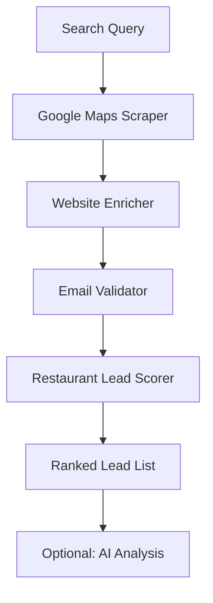

# Restaurant Lead Finder - Food & Beverage Marketing Leads

Find, enrich, and score restaurant leads from Google Maps. Built for restaurant tech companies, delivery platforms, and POS companies who need verified contact data and qualified lead lists.

## What it does

1. **Scrapes Google Maps** for restaurants matching your search query
2. **Enriches each restaurant** with website data, emails, and social profiles
3. **Validates emails** to ensure deliverability
4. **Scores and ranks leads** using a restaurant-tuned scoring algorithm where reviews and social presence matter most

## Why this exists

Restaurants live and die by reviews and social media. Generic lead scrapers weight phone and email equally, but in F&B, a restaurant with 500 reviews and active Instagram is a far better lead than one with just an email. This tool scores restaurants the way the industry actually works.

## Input examples

```json
{
    "searchQuery": "restaurants in Austin TX",
    "maxResults": 50,
    "enrichWebsites": true,
    "validateEmails": true,
    "minRating": 3.5
}
```

More search queries that work well:
- `"Italian restaurants San Francisco"`
- `"coffee shops Portland OR"`
- `"sushi restaurants New York"`
- `"Mexican restaurants Los Angeles"`
- `"pizza places Chicago"`
- `"fine dining restaurants Miami"`

## Output fields

| Field | Description |
|-------|-------------|
| `rank` | Position in scored results (1 = best lead) |
| `leadScore` | 0-100 quality score tuned for restaurant vertical |
| `restaurantName` | Restaurant name |
| `vertical` | Always `"restaurant"` |
| `category` | Google Maps category (cuisine type) |
| `address` | Full street address |
| `phone` | Phone number |
| `website` | Restaurant website URL |
| `rating` | Google Maps rating |
| `reviewCount` | Number of Google reviews (heavily weighted) |
| `emails` | Array of found emails with validation status |
| `socialProfiles` | Instagram, Facebook, TikTok, etc. |
| `enrichment` | Raw website enrichment data |
| `aiAnalysis` | AI-powered sales intelligence (optional) |

## Scoring algorithm (restaurant-tuned)

| Signal | Points | Why |
|--------|--------|-----|
| Has phone | +15 | Reservations and orders |
| Has website | +15 | Online presence baseline |
| Has email | +15 | Outreach channel |
| Email validated | +10 | Deliverable = actionable |
| Rating >= 4.0 | +20 | Rating is everything in F&B |
| Rating >= 4.5 | +5 bonus | Top-tier restaurant |
| Reviews > 50 | +15 | Reviews are KING for restaurants |
| Reviews > 200 | +10 bonus | High-volume established venue |
| Social profiles | +10 | Social is critical for F&B marketing |

## Pricing

**$25 per search** (pay-per-event). Each search scrapes, enriches, validates, and scores up to your `maxResults` limit.

## Who this is for

- Restaurant marketing agencies
- POS system sales teams (Toast, Square, Clover)
- Delivery platform partnerships (DoorDash, UberEats, Grubhub)
- Restaurant tech companies (reservation systems, loyalty apps)
- Food photography and branding agencies
- Restaurant supply companies

## Architecture


